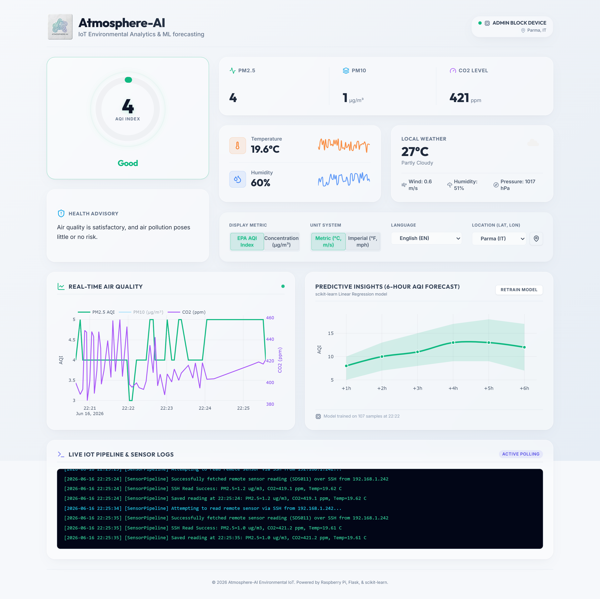
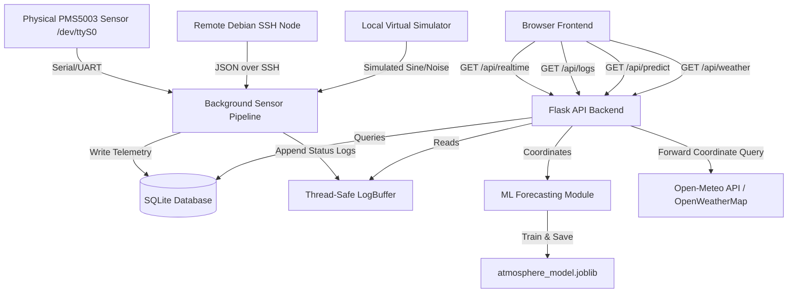

<p align="center">
  
</p>

# <p align="center">Atmosphere-AI: IoT Environmental Dashboard & ML Forecasting</p>

Atmosphere-AI is a professional-grade, self-contained IoT environmental monitoring and predictive dashboard. It coordinates real-time telemetry from physical serial sensors (such as the PMS5003 particulate matter sensor), remote SSH clusters (e.g., SDS011 or PMS5003 nodes on other Debian/Raspberry Pi devices), and local simulations. 


It calculates the **EPA Air Quality Index (AQI)**, renders beautiful real-time charts (including dual mini-trend sparklines), displays keyless localized weather conditions using the free **Open-Meteo API**, and uses a built-in **scikit-learn machine learning regression model** to train on historical database telemetry and predict future 6-hour AQI trends.

---

## 📸 Dashboard Preview

Here is the primary Bento-grid interface showing live physical readings, ambient trends, ML forecasts, and the color-coded logs console:




---

## 🌟 Key Features

1. **Vibrant Bento-Grid UI**: Modern glassmorphism panel design styling utilizing Tailwind CSS, responsive alignments, Outfit/Inter typography, and subtle interactive hover micro-animations.
2. **EPA AQI Dial & Advisory Panel**: A glowing SVG-based circular dial showing the calculated EPA Air Quality Index value and safety categories (Good, Moderate, Unhealthy for Sensitive Groups, Unhealthy, etc.) with automated dynamic health advisories.
3. **Ambient Metric Sparklines**: Stacked, grid-aligned Temperature and Humidity segments displaying current values alongside real-time, non-overlapping spline sparkline trend lines drawn with Plotly.
4. **Keyless Local Weather Integration**: Retrieves 100% accurate, real-world live local weather reports (temperature, humidity, wind, and conditions) for any coordinate preset using the keyless public **Open-Meteo API** (with optional fallback support for OpenWeatherMap).
5. **Machine Learning Forecasting**: Displays a future 6-hour prediction curve utilizing a scikit-learn `LinearRegression` model trained dynamically in a background thread on local SQLite database history.
6. **Device-Stored Settings**: Saves and restores language selections and location presets using the browser's `localStorage` (per-device client persistence).
7. **System Logs Terminal**: A terminal-style console at the bottom of the page showing real-time background thread logging (green for success, cyan for attempts, yellow for warnings, red for errors).


---

## ⚙️ Architecture & Data Flow



---

## 📁 Repository Structure

* [app.py](app.py): Core Flask application serving UI templates and JSON API endpoints. Spawns background worker loops and routes weather requests.
* [iot_sensor_pipeline.py](iot_sensor_pipeline.py): Background thread polling module that reads sensors from local UART serial port, remote nodes over SSH, or simulates data if hardware is unavailable.
* [ml_model.py](ml_model.py): Handles PM2.5-to-AQI conversion and scikit-learn Linear Regression modeling to calculate future trends.
* [database.py](database.py): Manages SQLite connection, table schema creation, data insertion, and auto-seeding of 24-hour dummy readings if the database is blank.
* [logger.py](logger.py): Thread-safe `LogBuffer` module shared between Flask routes and the background threads.
* [config.py](config.py): Contains system defaults, hardware configurations, SSH credentials, API keys, and polling settings loaded from local environment.
* [requirements.txt](requirements.txt): Lists Python package dependencies required for runtime execution.
* [templates/index.html](templates/index.html): HTML dashboard layout with localized text containers, Bento panels, and setting dialogs.
* [static/js/dashboard.js](static/js/dashboard.js): Frontend app logic, state management, Plotly visualization charts, translation matrices, and local storage state restorations.
* [static/css/style.css](static/css/style.css): Main stylesheet implementing the custom theme, glassmorphic panels, and glowing animations.
* [static/dashboard_screenshot.png](static/dashboard_screenshot.png): High-resolution Bento-grid UI screenshot.
* [.gitignore](.gitignore): Git ignore rules for environmental secrets, Python cache, SQLite database, and ML model files.

---

## 🔌 API Reference

| Endpoint | Method | Params | Description |
| :--- | :--- | :--- | :--- |
| `/` | `GET` | None | Serves the interactive Bento dashboard homepage. |
| `/favicon.ico` | `GET` | None | Resolves browser tab favicon requests. |
| `/api/realtime` | `GET` | None | Returns the latest sensor records from SQLite, calculated EPA AQI, and configured device tag. |
| `/api/logs` | `GET` | None | Returns the last 100 log lines from the background worker thread. |
| `/api/history` | `GET` | `limit` (int) | Fetches historical readings to populate the trend graphs. |
| `/api/weather` | `GET` | `lat` (float), `lon` (float) | Fetches real-world weather metrics from Open-Meteo (or OpenWeatherMap if API Key is set) or generates simulated localized fallback. |
| `/api/predict` | `GET` | None | Returns the future 6-hour forecast prediction. |
| `/api/retrain` | `POST` | None | Triggers immediate model retraining on the current SQLite dataset. |

---

## 🚀 Quick Setup (Local Dev)

Ensure you have Python 3.8+ installed.

### 1. Clone & Automated Setup
Clone the repository, create a virtual environment, and run the automated setup script to configure your environment:
```bash
# Clone the repository
git clone https://github.com/vedantjoliya/Atmosphere-AI.git
cd Atmosphere-AI

# Create and activate virtual environment
python -m venv venv
venv\Scripts\activate      # On Windows
source venv/bin/activate   # On Unix/Linux

# Run the automated local setup script
python setup_local.py
```
*(The setup script copies `.env.example` to `.env`, installs required pip packages, and creates/seeds your local SQLite database).*

### 2. Configure Remote Integrations (Optional)
If you want to pull data from physical sensors or host globally on Supabase, open `.env` and fill in your settings:
```env
# Supabase PostgreSQL Connection String (Leave blank to use local SQLite)
SUPABASE_DB_URL=

# OpenWeatherMap API Key (Leave blank to use keyless Open-Meteo)
OPENWEATHERMAP_API_KEY=
```

### 3. Run the Application
Start the Flask development server:
```bash
python app.py
```
Open your browser and navigate to `http://127.0.0.1:5000/`.
*(If no database connection string is provided, the application runs entirely in offline simulation mode, allowing zero-configuration testing).*


---

## 🛠️ Production Deployment Guide

For full, step-by-step documentation detailing systemd services, Gunicorn configuration, Nginx reverse proxy setups with Let's Encrypt SSL certificates, hardware serial wiring, and automated database backups, please refer to our dedicated guide:

👉 **[DEPLOYMENT.md](DEPLOYMENT.md)**
